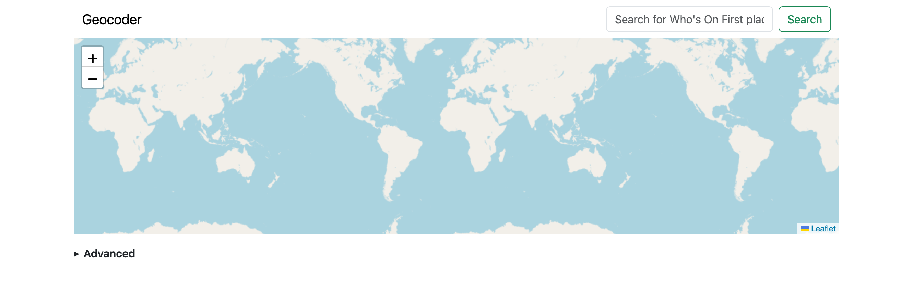
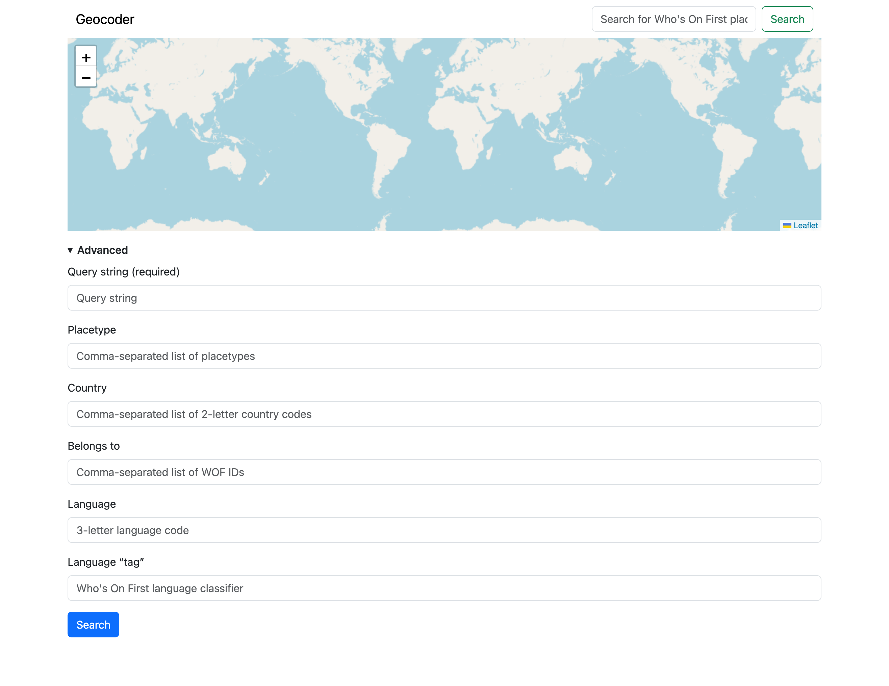
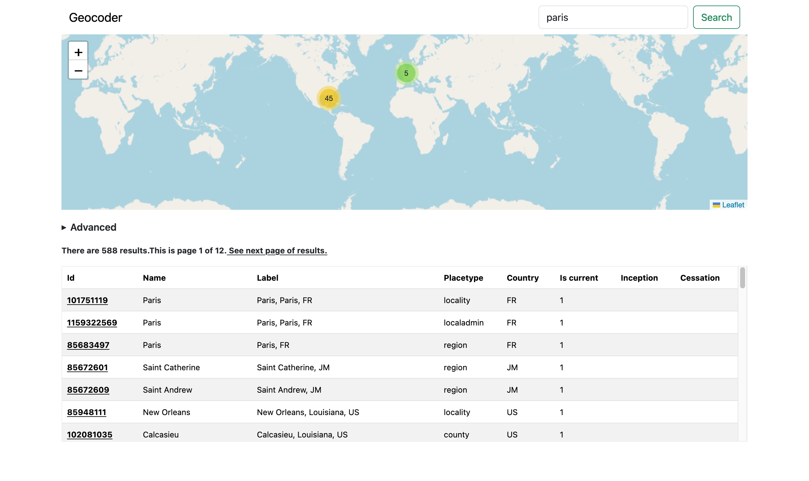
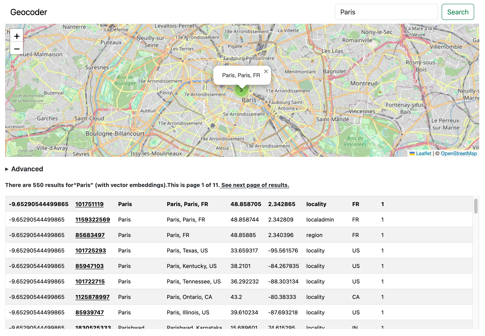
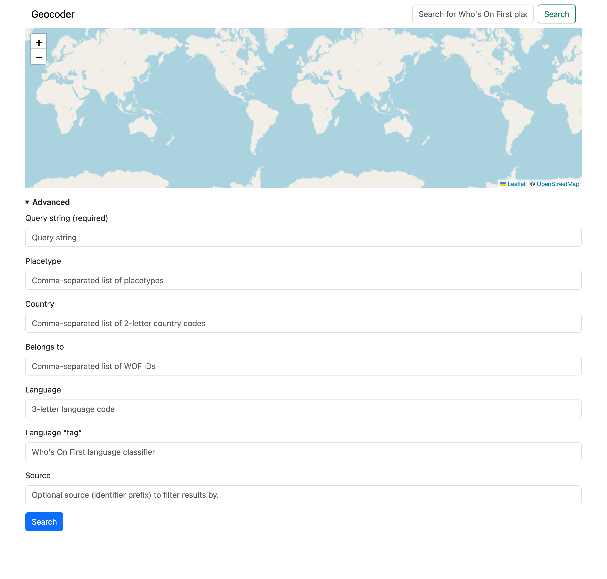
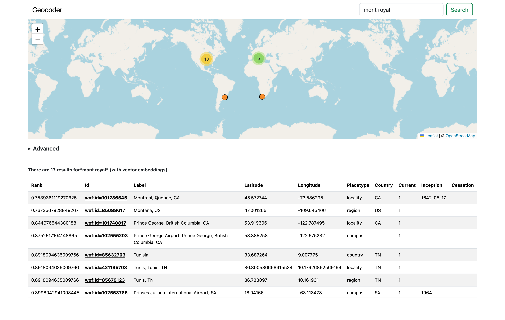
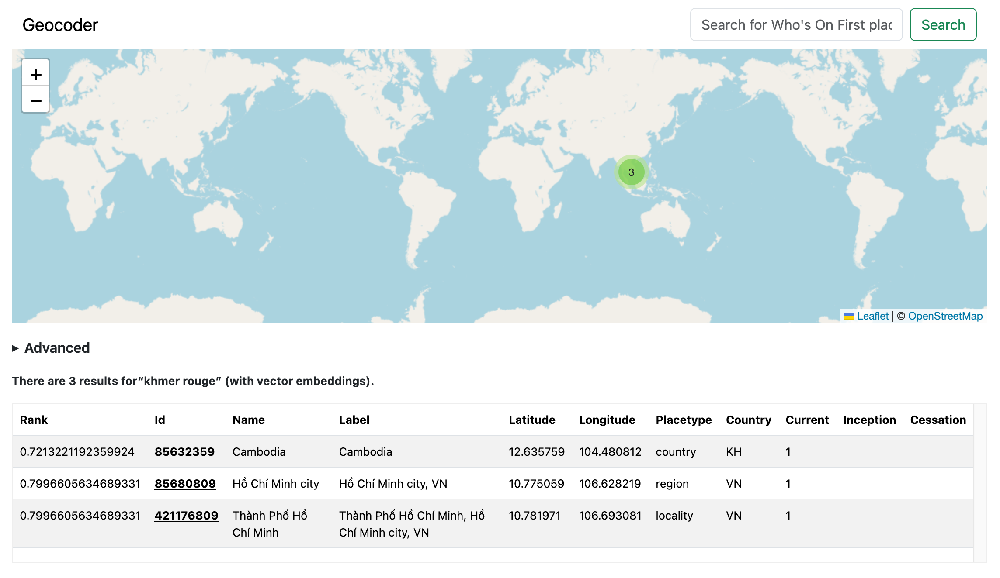

# geocoder

Who's On First-focused multi-lingual "coarse" geocoder.

## Motivation

These tools are modeled after the [pelias/placeholder](https://github.com/pelias/placeholder) project. SFO Museum needed something written in Go, with support for the exiting Go language Who's On First tooling and the ability to apply custom filtering (see below). So now this package exists.

## Documentation

[](https://pkg.go.dev/github.com/sfomuseum/geocoder)

## Almost stable

This package and the tools it provides are "almost stable". Which is to say there probably won't be any major changes but there _might_ be. Mostly the question centers on whether or not extra columns needed to be added to certain database tables for improved sorting. It's also possible that the internal `Record` data structure will be changed to make things a bit more flexible. This is discussed in the [Data sources](#data-sources) section below.

All of these things account for the initial `v0.9.0` version number. Once things have settled down it will be promoted to `v1.0.0`.

## Geocoding support

Currently only "coarse" (or admin-level) geocoding is supported. This does not include venues yet but will, eventually. I am not thinking about address-level geocoding at this time.

These tools do not do any kind of query "parsing" trying to derive specific properies or facets to filter by. For example parsing out that the query string "Montreal CA" should filter for records in Canada. Support for that kind of thing will probably be added in time but as of this writing the entire query string is used for matching.

### Query filters

Query strings may be filtered by the following:

* One or more 2-letter ISO country codes.
* One or more Who's On First placetypes or custom `wof:placetype_alt` placetypes.
* Start and end dates represented by ExtendedDateTimeFormat (EDTF) date strings.
* Custom bounding box.
* One or more Who's On First IDs which are ancestors (contain) result candidates.
* 3-letter language code for a place name.
* Who's On First language "tag" used to signal Who's On First classify a place name (for example: preferred, variant, historical, etc.)

## Database support

Currently only SQLite databases are supported. The design of the code (interfaces) is such that it should be possible to add other databases but that work has not happened yet.

Database tables are created at runtime, if necessary, so you don't need to do that manually. Database schemas can be found in [coarse/sql/*.schema](coarse/sql). Note that for reasons of efficiency none of the individual table schemas have indices. Additionally, by default, any existing indices and FTS-related tables are _removed_ before indexing is begun and then (re)created once indexing is complete. This behaviour can be modified but you'll need to be explicit about doing so.

Finally, the "post-indexing" phase currently takes longer than I would like to account for the need to de-duplicate rows in the `ancestors` and `placetypes_alt` tables before a unique indices are created. _This should not be necessary._ It suggests that the same Who's On First record is contained by two or more data sources (repositories) which is an error. That will be corrected in time but, until then, this extra step (and time) is necessary.

## Database URIs

Geocoding databases are specified using the `-geocoder-uri` flag which define database specifics in the form of a URI.

### SQLite

SQLite geocoder databases take the form of:

```
sql://sqlite?dsn={SQLITE_DSN_STRING}
```

For example:

```
sql://sqlite?dsn=wof.db
```

## Data files

This package does not contain any pre-built data files. Data files are created using the `wof-coarse-geocoder-index` tool described below.

SFO Museum has produced a data file containing records from all the [whosonfirst-data-admin-*](https://github.com/whosonfirst-data/?q=whosonfirst-data-admin), [sfomuseum-data-architecture](https://github.com/sfomuseum-data/sfomuseum-data-architecture) and [sfomuseum-data-whosonfirst](https://github.com/sfomuseum-data/sfomuseum-data-whosonfirst) repositories which can be downloaded like this:

```
$> curl -s -o wof-sfom.db https://static.sfomuseum.org/geocoder/wof-sfom.db
```

## Tools

```
$> make cli
go build -mod vendor -ldflags="" -o bin/wof-coarse-geocoder-index cmd/wof-coarse-geocoder-index/main.go
go build -mod vendor -ldflags="" -o bin/wof-coarse-geocoder-query cmd/wof-coarse-geocoder-query/main.go
go build -mod vendor -ldflags="" -o bin/wof-coarse-geocoder-server cmd/wof-coarse-geocoder-server/main.go
```

### wof-coarse-geocoder-index

Index one or more Who's On First data sources in a (coarse) geocoding database.

```
$> ./bin/wof-coarse-geocoder-index -h
Index one or more Who's On First data sources in a (coarse) geocoding database.
Usage:
	./bin/wof-coarse-geocoder-index [options] uri(N) uri(N) uri(N)
Valid options are:
  -embedder-uri string
    	A registered sfomuseum/go-embeddings.Embedder URI. (default "ollama://")
  -embeddings-cache
    	Cache embeddings lookups for strings. Cache keys are derived from: the current model + record id + language + language tag. (default true)
  -embeddings-index
    	Generate and store vector embeddings for place names. This feature is still considered experimental.
  -embeddings-model string
    	The URI for the model to use to generate embeddings. For the time being, do NOT change this unless you are using an alternate model with a dimensionality of 384. (default "hf.co/unsloth/bge-small-en-v1.5-GGUF:F16")
  -exclude-deprecated
    	Do not index records which have been deprecated. (default true)
  -exclude-funky
    	Do not index records which have been flagged as "funky". (default true)
  -exclude-nullisland
    	Do not index records that are "visiting" Null Island (have 0,0 coordinate data). (default true)
  -exclude-superseded
    	Do not index records which have been superseded.
  -fresh
    	This flags signals that a fresh database is being indexed disabling checks for existing or updated records.
  -geocoder-uri string
    	A registered sfomuseum/geocoder/coarse.Geocoder URI. (default "sql://sqlite?dsn=:memory:")
  -index-juggling
    	Perform indexing speed optiomizations. This will include dropping existing indices and the FTS table prior to indexing and (re)adding them at the end. (default true)
  -iterator-uri string
    	A registered whosonfirst/go-whosonfirst/v4/iterate.Iterate URI. (default "repo://")
  -offset int
    	Optional document offset to start indexing from.
  -prune
    	Prune existing records before (re)adding them to the database.
  -verbose
    	Enable verbose (debug) logging.
```	

For example:

```
$> ./bin/wof-coarse-geocoder-index \
	-fresh \
	-exclude-superseded=false \
	-iterator-uri repo:// \
	-geocoder-uri 'sql://sqlite?dsn=sfom.db' \
	/usr/local/data/sfomuseum-data-architecture \
	/usr/local/data/sfomuseum-data-whosonfirst
	
2026/08/08 11:15:04 INFO Rewrote iterator URI uri="repo:?exclude=properites.edtf%3Adeprecated%3D.%2A&exclude=properites.wof%3Asuperseded_by%3D.%2A&exclude=properites.mz%3Ais_funky%3D1"
2026/08/08 11:15:04 INFO Pre-indexing complete time=154.5µs
2026/08/08 11:16:04 INFO Iterator stats elapsed=1m0.001052708s seen=2530 allocated="9.7 MB" "total allocated"="498 MB" sys="54 MB" numgc=103
2026/08/08 11:16:04 INFO Indexing stats elapsed=1m0.001189958s seen=2530 "average (ms)"=0.09881422924901186

...time passes

2026/08/08 11:21:04 INFO Iterator stats elapsed=6m0.00110525s seen=3469 allocated="37 MB" "total allocated"="4.2 GB" sys="275 MB" numgc=287
2026/08/08 11:21:33 INFO Iterator stats elapsed=6m29.009900916s seen=3623 allocated="60 MB" "total allocated"="4.4 GB" sys="275 MB" numgc=294
2026/08/08 11:21:33 INFO Indexing complete seen=3623 time=6m29.014973666s "average (ms)"=0.2555892906431134
2026/08/08 11:21:34 INFO Post-indexing complete time=661.16725ms "time (total)"=6m29.676154166s
```

Indexing time can depend a lot on the data source. Files on disk (above) can take a while. Indexing Who's On First Parquet files (produced by the [wof-parquet-export](https://github.com/whosonfirst/go-whosonfirst) tool in the `whosonfirst/go-whosonfirst` package) is significantly faster, taking only 20-30 minutes to create a geocoding database for all 6 million plus records:

```
$> ./bin/wof-coarse-geocoder-index \
	-fresh \
	-iterator-uri parquet:// \
	-geocoder-uri 'sql://sqlite?dsn=wof-sfom.db' \
	/usr/local/data/whosonfirst-parquet/whosonfirst-data-admin-*.parquet
	
2026/08/08 11:31:00 INFO Rewrote iterator URI uri="parquet:?exclude=properites.edtf%3Adeprecated%3D.%2A&exclude=properites.wof%3Asuperseded_by%3D.%2A&exclude=properites.mz%3Ais_funky%3D1"
2026/08/08 11:31:00 INFO Pre-indexing complete time=88.792µs
2026/08/08 11:32:00 INFO Iterator stats elapsed=1m0.000199625s seen=319775 allocated="3.2 GB" "total allocated"="38 GB" sys="4.5 GB" numgc=88
2026/08/08 11:32:00 INFO Indexing stats elapsed=1m0.000307583s seen=319765 "average (ms)"=0.09237721451691086

...time passes

2026/08/08 11:51:01 INFO Iterator stats elapsed=20m1.057480125s seen=6457706 allocated="4.1 GB" "total allocated"="576 GB" sys="19 GB" numgc=374

...more time passes

2026/08/08 12:01:46 INFO Post-indexing complete time=10m44.596903375s "time (total)"=30m45.71374225s

```

_Note that these Who's On First Parquet files are not available for download from the Who's On First servers yet so you'll need to create them manually. SFO Museum might provide alternate downloads in the interim._

That database, in turn, can be supplemented with SFO Museum specific Who's On First style data repositories. For example:

```
$> ./bin/wof-coarse-geocoder-index \
	-prune \
	-iterator-uri repo:// \
	-geocoder-uri 'sql://sqlite?dsn=wof-sfom.db' \
	/usr/local/data/sfomuseum-data-architecture \
	/usr/local/data/sfomuseum-data-whosonfirst
	
2026/08/08 12:33:40 INFO Rewrote iterator URI uri="repo:?exclude=properites.edtf%3Adeprecated%3D.%2A&exclude=properites.wof%3Asuperseded_by%3D.%2A&exclude=properites.mz%3Ais_funky%3D1"
2026/08/08 12:33:40 INFO Pre-indexing complete time=95.542µs
2026/08/08 12:34:40 INFO Iterator stats elapsed=1m0.001063042s seen=1229 allocated="5.2 MB" "total allocated"="262 MB" sys="46 MB" numgc=60
2026/08/08 12:34:40 INFO Indexing stats elapsed=1m0.001180792s seen=1229 "average (ms)"=0.10903173311635476

...time passes

2026/08/08 12:42:25 INFO Iterator stats elapsed=8m44.648322417s seen=3623 allocated="43 MB" "total allocated"="4.4 GB" sys="317 MB" numgc=295
2026/08/08 12:42:25 INFO Indexing complete seen=3623 time=8m44.654067s "average (ms)"=0.281810654154016
...
2026/08/08 12:48:44 INFO Post-indexing complete time=6m19.407913166s "time (total)"=15m4.061988625s

$> du -h wof-sfom.db 
6.5G	wof-sfom.db
```

Valid data sources are anything the [whosonfirst/go-whosonfirst/v4/iterate](https://github.com/whosonfirst/go-whosonfirst/tree/main/iterate) package can support. Please consult documentation for details.

### wof-coarse-geocoder-query

Query a Who's On First (coarse) geocoding database.

```
$> ./bin/wof-coarse-geocoder-query -h
Query a Who's On First (coarse) geocoding database.
Usage:
	./bin/wof-coarse-geocoder-query [options]
Valid options are:
  -belongs-to value
    	Zero or more Who's On First ancestor IDs to filter results by.
  -bounds string
    	Optional bounding box (in the form of 'minx,miny,maxx,mayx') to filter results by.
  -country value
    	Zero or more 2-letter country codes to filter results by.
  -date-ends string
    	Optional ETDF ending date string to filter results by.
  -date-starts string
    	Optional ETDF starting date string to filter results by.
  -embedder-uri string
    	A registered sfomuseum/go-embeddings.Embedder URI. (default "ollama://")
  -embeddings-model string
    	The URI for the model to use to generate embeddings. For the time being, do NOT change this unless you are using an alternate model with a dimensionality of 384. (default "hf.co/unsloth/bge-small-en-v1.5-GGUF:F16")
  -embeddings-search
    	Generate and use vector embeddings for search terms to query records. This feature is still considered experimental.
  -geocoder-uri string
    	A registered sfomuseum/geocoder/coarse.Geocoder URI. (default "null://")
  -lang string
    	An optional (3-letter) language code to filter results by,
  -mode string
    	Output mode for results. Valid options are: geojson, tab. (default "tab")
  -page int
    	The specific page number to query for paginated result sets. (default 1)
  -per-page int
    	The number of results to include for paginated result sets. (default 100)
  -placetype value
    	Zero or more placetypes to filter results by.
  -query string
    	The term to query for. Required.
  -query-timeout int
    	The maximum allowable time in seconds for a query to complete. (default 5)
  -tag string
    	An option WOF language tag to filter results by.
  -verbose
    	Enable verbose (debug) logging.
```	

For example:

```
$> ./bin/wof-coarse-geocoder-query \
	-geocoder-uri 'sql://sqlite?dsn=wof.db' \
	-query T3

2026/08/08 11:25:22 INFO Query results total=7 page=1 pages=1

rank				id			label																						placetype		latitude	longitude	is current	inception	cessation
-17.33661134210852	1947304447	Terminal 3, SFO Terminal Complex, San Francisco International Airport, San Francisco, US	wing; terminal	37.618362	-122.386773	1			2024-11-05	..
-17.33661134210852	1159157307	Terminal 3, SFO Terminal Complex, San Francisco International Airport, San Francisco, US	wing; terminal	37.618362	-122.386773	0			2017~		2019-07-23
-17.33661134210852	1477855699	Terminal 3, SFO Terminal Complex, San Francisco International Airport, San Francisco, US	wing; terminal	37.618362	-122.386773	0			2019-07-23	2020-~05
-17.33661134210852	1729792487	Terminal 3, SFO Terminal Complex, San Francisco International Airport, San Francisco, US	wing; terminal	37.618362	-122.386773	0			2020-~05	2021-05-25
-17.33661134210852	1745882233	Terminal 3, SFO Terminal Complex, San Francisco International Airport, San Francisco, US	wing; terminal	37.618362	-122.386773	0			2021-05-25	2021-11-09
-17.33661134210852	1763588269	Terminal 3, SFO Terminal Complex, San Francisco International Airport, San Francisco, US	wing; terminal	37.618362	-122.386773	0			2021-11-09	2024-06-17
-17.33661134210852	1914600841	Terminal 3, SFO Terminal Complex, San Francisco International Airport, San Francisco, US	wing; terminal	37.618362	-122.386773	0			2024-06-17	2024-11-05
```

Or to query with a custom placetype (stored in the `wof:placetype_alt` property):

```
$> ./bin/wof-coarse-geocoder-query \
	-geocoder-uri 'sql://sqlite?dsn=wof-sfom.db' \
	-query SFO \
	-placetype airport

2026/08/08 11:27:37 INFO Query results total=1 page=1 pages=1

rank				id			label																placetype		latitude	longitude	is current	inception	cessation
-13.013866678659102	102527513	San Francisco International Airport, San Francisco, California, US	campus; airport	37.61799	-122.370943	1			1948~		..
```

You can also query for records using a known concordances, for example an IATA airport code:

```
$> ./bin/wof-coarse-geocoder-query \
	-geocoder-uri 'sql://sqlite?dsn=wof-sfom.db' \
	-query iata:code=YUL
	
2026/08/08 13:06:39 INFO Query results total=1 page=1 pages=1

rank				id			label																		placetype	latitude	longitude	is current	inception	cessation
-7.027890456522998	102554351	Montreal-Pierre Elliott Trudeau International Airport, Dorval, Quebec, CA	campus		45.462004	-73.744749	1			1941-09-01
```

Or a GeoPlanet identifier:

```
$> ./bin/wof-coarse-geocoder-query \
	-geocoder-uri 'sql://sqlite?dsn=wof-sfom.db' \
	-query gp:id=27978
	
2026/08/08 13:09:26 INFO Query results total=2 page=1 pages=1

rank				id			label						placetype						latitude	longitude	is current	inception	cessation
-6.48038846479113	101750367	London, Greater London, GB	locality; county; localadmin	51.509648	-0.099076	1			0043~		
-6.122169631962154	1880762729	Greater London, GB			region							51.49254	-0.109335	1			
```

The geocoder will pass the so-called "Brooklyn test" in English:

```
$> ./bin/wof-coarse-geocoder-query \
	-geocoder-uri 'sql://sqlite?dsn=wof-sfom.db' \
	-query brooklyn \
	-per-page 10
	
2026/08/09 22:20:13 INFO Query results total=135 page=1 pages=14

rank				id			label								placetype		latitude	longitude	is current	inception	cessation
-10.619758199476777	421205765	Brooklyn, New York, New York, US	borough			40.652256	-73.956582	1				
-10.619758199476777	101712549	Brooklyn, Ohio, US					locality		41.433531	-81.751846	1				
-10.619758199476777	404525053	Brooklyn, Ohio, US					localadmin		41.433531	-81.751846	1				
-10.619758199476777	404495913	Brooklyn, Connecticut, US			localadmin		41.787597	-71.953053	1				
-10.619758199476777	85807887	Brooklyn, Jacksonville, Florida, US	neighbourhood	30.31732	-81.676342	1				
-10.619758199476777	85807897	Brooklyn, Portland, Oregon, US		neighbourhood	45.495203	-122.648672	1				
-10.619758199476777	85942463	Brooklyn, Indiana, US				locality		39.54363	-86.369575	1				
-10.619758199476777	1126026579	Brooklyn, Wellington Region, NZ		locality		-41.31667	174.75		1				
-10.619758199476777	85943755	Brooklyn, Iowa, US					locality		41.729445	-92.446958	1				
-10.619758199476777	85951193	Brooklyn, Michigan, US				locality		42.105725	-84.248831	1
```

And in other languages, like Farsi:

```
$> ./bin/wof-coarse-geocoder-query \
	-geocoder-uri 'sql://sqlite?dsn=wof-sfom.db' \
	-query بروکلین \
	-per-page 10
	
2026/08/09 22:22:22 INFO Query results total=72 page=1 pages=8

rank				id			label								placetype		latitude	longitude	is current	inception	cessation
-10.619758199476777	421205765	Brooklyn, New York, New York, US	borough			40.652256	-73.956582	1				
-10.619758199476777	101712549	Brooklyn, Ohio, US					locality		41.433531	-81.751846	1				
-10.619758199476777	404525053	Brooklyn, Ohio, US					localadmin		41.433531	-81.751846	1				
-10.619758199476777	404495913	Brooklyn, Connecticut, US			localadmin		41.787597	-71.953053	1				
-10.619758199476777	85807887	Brooklyn, Jacksonville, Florida, US	neighbourhood	30.31732	-81.676342	1				
-10.619758199476777	85807897	Brooklyn, Portland, Oregon, US		neighbourhood	45.495203	-122.648672	1				
-10.619758199476777	85942463	Brooklyn, Indiana, US				locality		39.54363	-86.369575	1				
-10.619758199476777	1126026579	Brooklyn, Wellington Region, NZ		locality		-41.31667	174.75		1				
-10.619758199476777	85943755	Brooklyn, Iowa, US					locality		41.729445	-92.446958	1				
-10.619758199476777	85951193	Brooklyn, Michigan, US				locality		42.105725	-84.248831	1
```

### wof-coarse-geocoder-server

HTTP server for handling requests against a Who's On First (coarse) geocoding database.

```
$> ./bin/wof-coarse-geocoder-server -h
HTTP server for handling requests against a Who's On First (coarse) geocoding database.
Usage:
	./bin/wof-coarse-geocoder-server [options]
Valid options are:
  -allow-query-embeddings
    	Enable vector embedding queries in the /api/query endpoint. Query embeddings are still considered experimental. (default true)
  -demo
    	Start a web-based demo on the root URL of the server.
  -geocoder-uri string
    	A registered sfomuseum/geocoder/coarse.Geocoder URI. (default "null://")
  -pagination-per-page int
    	The maximum number of results to include per API request. (default 50)
  -prefix string
    	An optional URL prefix to listen for requests on.
  -query-timeout int
    	The maximum allowable time in seconds for a query to complete. (default 5)
  -server-uri string
    	A registered aaronland/go-http/v4/server.Server URI. (default "http://localhost:8080")
  -verbose
    	Enable verbose (debug) logging.
```	

For example:

```
$> make server GEOCODER_URI='sql://sqlite?dsn=test.db'
go run -mod vendor cmd/wof-coarse-geocoder-server/main.go \
		-verbose \
		-server-uri http://localhost:8080 \
		-geocoder-uri sql://sqlite?dsn=test.db
2026/08/05 10:05:35 DEBUG Verbose logging enabled
2026/08/05 10:05:35 INFO Listening for requests address=http://localhost:8080

2026/08/05 10:07:23 DEBUG Time to query query=SFO time=3.302416ms
```

And then:

```
$> curl -s 'http://localhost:8080/api/query/?query=SFO&placetype=airport' | jq
{
  "pagination": {
    "total": 1,
    "per_page": 50,
    "page": 1,
    "pages": 1,
    "next_page": 0,
    "previous_page": 0
  },
  "results": {
    "features": [
      {
        "id": 102527513,
        "type": "Feature",
        "bbox": [
          -122.408061,
          37.601617,
          -122.354907,
          37.640167
        ],
        "geometry": {
          "type": "Point",
          "coordinates": [
            -122.370943,
            37.61799
          ]
        },
        "properties": {
          "edtf:cessation": "..",
          "edtf:inception": "1948~",
          "geocoder:rank": -13.013866678659102,
          "mz:is_current": 1,
          "wof:country": "US",
          "wof:hierarchies": [
            {
              "campus_id": 102527513,
              "continent_id": 102191575,
              "country_id": 85633793,
              "county_id": 102087579,
              "locality_id": 85922583,
              "postalcode_id": 554784711,
              "region_id": 85688637
            },
            {
              "campus_id": 102527513,
              "continent_id": 102191575,
              "country_id": 85633793,
              "county_id": 102085387,
              "region_id": 85688637
            }
          ],
          "wof:id": 102527513,
          "wof:label": "San Francisco International Airport, San Francisco, California, US",
          "wof:name": "San Francisco International Airport",
          "wof:parent_id": 85922583,
          "wof:placetype": "campus",
          "wof:placetype_alt": [
            "airport"
          ]
        }
      }
    ],
    "type": "FeatureCollection"
  }
}
```

#### API

##### /api/query/


This API method accepts form data (either `application/x-www-form-urlencoded` or `multipart/form-data`) and returns a JSON payload containing a GeoJSON `FeatureCollection` together with pagination metadata.

###### Basic Request

| Parameter | Type | Required | Description |
|-----------|------|----------|-------------|
| `query` | string | yes | The search term (e.g. "Paris”, “Dallas", etc). |

For example:

```
$> curl -X POST \
	-F "query=Paris" \
	http://localhost:8080/api/query
```

###### Optional Parameters

| Parameter | Type | Description |
|-----------|------|-------------|
| `country` | string (multi‑value) | Two‑letter ISO country code(s). Limits results to places that belong to the specified country/ies. Example: `country=US` or `country=US&country=CA`. |
| `belongs-to` | integer (multi‑value) | Ancestor WOF IDs that the results must belong to. Example: `belongs-to=12345678`. |
| `placetype` | string (multi‑value) | One or more place‑type identifiers (e.g. `city`, `river`). Example: `placetype=location&placetype=region`. |
| `lang` | string | Three‑letter language code that restricts the search to tokens in that language. |
| `tag` | string | WOF language tag (e.g. `preferred`, `variant`). |
| `bounds` | string | Geographic bounding box in the form `"minx,miny,maxx,maxy"`. Example: `bounds=-10.0,35.0,10.0,45.0`. |
| `date-starts` | string | An [EDTF](https://www.loc.gov/standards/edtf/) expression that defines a start‑date range. The server will expand it into a set of ranges. |
| `date-ends` | string | Same as `date-starts` but for the end date. |
| `query-embeddings` | string | JSON‑encoded array of `float32` values (e.g. `"[0.12,0.34,0.56]"`). Only accepted if the server was configured with `AllowQueryEmbeddings=true`. |
| `page` | integer | Page number for pagination (default is 1). |


###### Pagination

The server paginates results automatically. To request a particular page:

```
$> curl -X POST \
	-F "query=London" \
	-F "page=2" \
	http://localhost:8080/api/query
```

The JSON response will include a `pagination` object that contains:

* `total` – total number of matching results
* `page` – current page number
* `per_page` – number of results per page
* `pages` – total number of pages

###### Date Filters

Both `date-starts` and `date-ends` accept EDTF strings. The server uses the [sfomuseum/go-edtf/unix](https://pkg.go.dev/github.com/sfomuseum/go-edtf/unix) package to convert these into Unix‑timestamp ranges. For example:

```
$> curl -X POST \
	-F "query=Berlin" \
	-F "date-starts=2000" \
	http://localhost:8080/api/query

$> curl -X POST \
	-F "query=Berlin" \
	-F "date-starts=1900/1950" \
	http://localhost:8080/api/query
```

If the EDTF expression is invalid, the server will return a 400 Bad Request.

###### Bounds

The `bounds` parameter limits results to places whose bounding boxes intersect the supplied rectangle in the form of `minx,miny,maxx,maxy`.

```
$> curl -X POST \
	-F "query=springfield" \
	-F "bounds=-120.0,30.0,-110.0,40.0" \
	http://localhost:8080/api/query
```

###### Vector embeddings

If the server was started with `AllowQueryEmbeddings=true`, you can supply a vector that the geocoder will use to weigh semantic similarity.

```
$> curl -X POST \
	-F 'query-embeddings=[0.12,0.34,0.56,0.78, ...]' \
	http://localhost:8080/api/query
```

_Caution – If embeddings are not enabled, the server will respond with `400 Bad Request` and the message “Query embeddings are not supported”. Query embeddings are still considered experimental. [See details below.](#vector-embeddings)_

#### Demo mode

When started with the `-demo` flag the server will host a simple web application at its root URL. When you open your web browser to `http://localhost:8080` (or whatever you've configured the `-server-uri` flag to be) you'll see something like this:



By default you can enter a query term in the search box in the top-right hand corner but you can also perform a more detailed query by opening the "Advanced" menu beneath the map:



Query results are displayed on the map and in a list view beneath the map:



Clicking on either a location's point on the map or its ID in list view will display its map label and jump to the record in the list view.



That's all it does for the time being.

## Data sources

Currently, only Who's On First-shaped documents are supported. Internally those documents are transformed in an internal `Record` struct which looks like this:

```
type Record struct {
	Id             int64                          `json:"wof:id"`
	ParentId       int64                          `json:"wof:parent_id"`
	Name           string                         `json:"wof:name"`
	Country        string                         `json:"wof:country"`
	Placetype      string                         `json:"wof:placetype"`
	PlacetypeAlt   []string                       `json:"wof:placetype_alt"`
	Hierarchies    []map[string]int64             `json:"wof:hierarchies"`
	Centroid       *orb.Point                     `json:"wof:centroid"`
	Bounds         []orb.Bound                    `json:"wof:bounds"`
	Inception      string                         `json:"edtf:inception,omitempty"`
	Cessation      string                         `json:"etdf:cessation,omitempty"`
	PopulationRank int64                          `json:"wof:population_rank,omitempty"`
	IsCurrent      string                         `json:"mz:is_current,omitempty"`
	Tokens         map[string]map[string][]string `json:"tokens,omitempty"`
}
```

Going forward the "easiest" thing may be to simply change this data structure to assume that all identifiers are strings – specifically machinetag-based string identifiers – and do the extra work, internally, to convert them to and from their source values. Maybe? It's just too soon to think about right now.

Otherwise, the `IsCurrent` property may be changed to an `int64` value (-1, 0, 1) and some sort of "source" property may be added. These remain "to be determined".

## Experimental

### Vector embeddings

There is experimental support for storing and querying vector embeddings for place names. This is enabled by passing the `-embeddings-index` flag to the [wof-coarse-geocoder-index](#wof-coarse-geocoder-index) tool and/or the `-embeddings-search` flag to the [wof-coarse-geocoder-query](#wof-coarse-geocoder-query) tool.

In both cases you will need to provide additional command-line arguments to define the process to _create_ vector embeddings (for indexing or querying). Under the hood this package uses the [sfomuseum/go-embeddings](https://github.com/sfomuseum/go-embeddings) package which defines a common interface to creating vector embeddings from a variety of sources. Practically speaking this means you will need to run a separate service (like [Ollama](https://ollama.com) or [llama.cpp](https://llama.app)) with its own API endpoint to create embeddings for use with the geocoder.

An important consideration, as of this writing, is that the underlying `geocoder` database does NOT support vector embeddings of varying dimensions and the default dimensionality is 384. This value is hard-coded pending further consideration about how to make these things dynamic. The choice of 384-dimension embeddings is because that's what the `bert-bge-small/ggml-model-f16.gguf` model produces and that model is used to generate client-side embeddings in the "demo" web application. This is [described further below](#querying-vector-embeddings-in-the-demo-server).

#### Embeddings for what?

As of this writing a single embedding is generated for the unique set of names for each (language + language tag) pair for each record. Is this the best way? I don't know. Because it takes a while to generate and store a lot of embeddings, and because Who's On First records often have a lot of different names (and languages), it seemed like a reasonable compromise just to prove that storing and querying vector embeddings was feasible. There is more work, and more investigating, to do.

[Feedback or alternative approaches are welcome and encouraged.](https://github.com/sfomuseum/geocoder/issues)

#### Indexing

For example:

```
$> bin/wof-coarse-geocoder-index/main.go \
	-embeddings-index \
	-embedder-uri ollama:// \
	-fresh \
	-geocoder-uri 'sql://sqlite?dsn=us-vec384.db' \
	-iterator-uri parquet:// \
	/usr/local/data/whosonfirst-parquet/whosonfirst-data-admin-us.parquet
```

Note that indexing with vector embeddings, even when embeddings for the same place names are cached, takes significantly longer than indexing data without vector embeddings.

#### Querying

Query for records the same as you normally would but pass in the `-embeddings-search` flag. For example:

```
$> ./bin/wof-coarse-geocoder-query \
	-embeddings-search \
	-embedder-uri 'ollama://' \
	-geocoder-uri 'sql://sqlite?dsn=us-vec384.db' \
	-query 'airport sfba' \
	-per-page 10

2026/08/21 10:16:40 INFO Query results total=29 page=1 pages=3

rank			id		label									placetype	latitude	longitude	is current	inception	cessation
0.5294566750526428	102527513	San Francisco International Airport, San Francisco, California, US	campus		37.61799	-122.370943	1		1948~		..
0.5966955423355103	102530873	Yuba County Airport, Olivehurst, California, US				campus		39.097801	-121.57		1				
0.606959342956543	102528839	San Carlos Airport, San Carlos, California, US				campus		37.511902	-122.25		1				
0.6179097890853882	102527337	Santa Barbara Municipal Airport, Santa Barbara, California, US		campus		34.427974	-119.837133	1				
0.6228018999099731	102527529	Norman Y Mineta San Jose International Airport, California, US		campus		37.363728	-121.928755	1		2001-11		..
0.641245424747467	404517201	Airport Township, Missouri, US						localadmin	38.741639	-90.359883	1				
0.641245424747467	85926473	Airport, California, US							locality	37.632083	-120.979923	1				
0.641245424747467	420539489	Airport, Philadelphia, Philadelphia, Pennsylvania, US			neighbourhood	39.885787	-75.213489	1				
0.641245424747467	1729434409	Airport, Missouri, US							locality	38.750377	-90.363144	1				
0.6423512697219849	102528473	Flabob Airport, Jurupa Valley, California, US				campus		33.9894		-117.40997	1
```

Remember: This is not doing full text search. It is searching for the closest vector embeddings created by, and stored in, a large language model whose internals are probably opaque and poorly understood. This stuff can be amazing when it works but few people, if anyone, understands what's _actually_ happening under the hood or more importantly _why_. As often as not it's just plain weird.

#### Querying vector embeddings in the API

Querying vector embeddings in the API is enabled by default in the [wof-coarse-geocoder-server](#wof-coarse-geocoder-server) tool. You can disable it, if necessary, by passing in the `-allow-query-embeddings=false` flag. For example:

```
$> make server GEOCODER_URI='sql://sqlite?dsn=vec384.db'
go run -mod vendor cmd/wof-coarse-geocoder-server/main.go \
		-demo \
		-verbose \
		-allow-query-embeddings \
		-server-uri http://localhost:8080 \
		-geocoder-uri sql://sqlite?dsn=vec384.db
2026/08/19 18:21:20 DEBUG Verbose logging enabled
2026/08/19 18:21:20 INFO Listening for requests address=http://localhost:8080
2026/08/19 18:22:14 DEBUG Time to query query="mont AND royal*" "query embeddings"=true total=8 time=128.005042ms
```

The API endpoint does NOT create vector embeddings itself. This is assumed to be handled by an external process. Once you've created those embeddings you can pass them along to the API, as a JSON-encoded string, in the `query-embeddings` parameter. For example:

```
$> curl -X POST \
	-F 'query-embeddings=[...]' \
	http://localhost:8080/api/query/
```

#### Querying vector embeddings in the "demo" server

Querying vector embeddings in the "demo" server is NOT enabled by default. This functionality depends on the presence of the [ngxson/wllama](https://github.com/ngxson/wllama) Javascript library and the WebAssembly binary in addition to the `bert-bge-small/ggml-model-f16.gguf` (large language) model. All of these assets _could_ be loaded remotely but one of the design criteria for the API/demo server is that all its assets are bundled locally.

The `wllama` and `bert-bge-small` assets are not bundled with this repository to prevent unnecessary bloat; these files are also explicitly excluded from version control. You can download these assets using the handy `embeddings` Makefile target in the [http/www/coarse](http/www/coarse) folder. For example:

```
$> cd http/www/coarse
$> make embeddings
curl -sL -o javascript/wllama.js https://github.ngxson.com/wllama/esm/index.js
curl -sL -o wasm/wllama.wasm https://github.ngxson.com/wllama/esm/wasm/wllama.wasm
curl -sL -o models/bert-bge-small/ggml-model-f16.gguf https://huggingface.co/ggml-org/models/resolve/main/bert-bge-small/ggml-model-f16.gguf
```

The [ngxson/wllama](https://github.com/ngxson/wllama) package provides WebAssembly bindings for the [llama.cpp](https://github.com/ggerganov/llama.cpp) library which, in turn, enables the ability to create vector embeddings client-side in a web browser which is kind of _bonkers amazing_ when you think about it. The WebAssembly binary still depends on a third-party model to derive embeddings. The `ngxson/wllama` package uses the `bert-bge-small/ggml-model-f16.gguf` model in its examples and is only 69MB (rather than, say, 10 or 20GB) so that's what this package uses too. At least for the time being.

Now start the `wof-coarse-geocoder-server` tool as usual (see above). The application code for the "demo" server will check to see whether the `wllama` assets are available and if they are, will enable an addition "Query with vector embeddings" checkbox in the "Advanced" query menu. For example:



Querying for "mont royal" returns Montreal:



Querying for "khmer rouge" returns Cambodia and	Hồ Chí Minh city, in Vietnam, which is not _incorrect_ historically:



Anything else may get weird. Large language models are weird.

### Virtual File System (VFS) support

#### Bundled filesystems

There is experimental (SQLite) VFS support for `geocoder` databases which are bundled with an application using an embedded file system. In order to use this functionality you want to create a geocoder instance using the `coarse.NewSQLGeocoderWithFS` method. This means you will have to write and compile custom code. See the [cmd/wof-coarse-geocoder-query-fs](cmd/wof-coarse-geocoder-query-fs/main.go) and [cmd/wof-coarse-geocoder-server-fs](cmd/wof-coarse-geocoder-server-fs/main.go) tools for details.

#### Remote (HTTP) data

There is experimental (SQLite) VFS support for `geocoder` databases hosted on remote HTTP(S) servers, for example AWS S3. To enable remote VFS databases add the following query parameters to you `-geocoder-uri` URi:

| Name | Type | Required | Notes |
| --- | --- | --- | --- |
| vfs-enable | boolean | yes | This is the query parameter that gets everything started. |
| vfs-base | string | yes | The root URL of the remote database to use. |
| vfs-dbname | string | yes | The name of the remote database to use. |
| vfs-timeout | int | no | The default timeout in seconds for the VFS HTTP client. Default is 5. |

For example:

```
$> bin/wof-coarse-geocoder-query \
	-geocoder-uri 'sql://sqlite?vfs-enable=true&vfs-base=https://static.sfomuseum.org/geocoder&vfs-dbname=wof-sfom.db' \
	-query-timeout 15 \	
	-query gowanus
	
2026/08/12 12:51:39 INFO Rewrite geocoder URI to enable VFS uri="sql://sqlite?dsn=file%3Awof-sfom.db%3Fvfs%3Dvfs1%26mode%3Dro"
2026/08/12 12:51:43 INFO Query results total=2 page=1 pages=1

rank				id			label									placetype		latitude	longitude	is current	inception	cessation
-17.49931058334353	85865587	Gowanus, New York, New York, US			neighbourhood	40.678529	-73.987462	1				
-15.032719333750485	102061079	Gowanus Heights, New York, New York, US	neighbourhood	40.682373	-73.987939	-1			2012	
```

Note the use of the `-query-timeout` flag. The default query timeout is 5 seconds which may not be enough depending on the specifics of your remote database (VFS) configuration. For example, initial testing using a VFS layer in an Amazon AWS Lambda + AWS S3 setup required timeouts in excess of 30 seconds which largely makes it impractical for most applications.

### Getty Thesaurus of Geographic Names (TGN)

There is experimental support for indexing place records from Getty's Thesaurus of Geographic Names (TGN). This support manages to map Getty place details on to the existing `Record` data structure described above.

Wherever possible TGN placetypes are mapped to their Who's On First equivalent. When a match is not found that place is assigned a Who's On First placetype of "custom". Both parts of a TGN placetype (its numeric identifier and string label) are indexed, separately, as alternate placetypes. The placetypes mappings can be found in [x/tgn/placetypes.json](x/tgn/placetypes.json). These choices may contain errors or inaccuracies and we welcome your feedback if you think that is the case.

These placetype mappings are also used to construct a Who's On First style hierarchy. This hierarchy is important because, as of this writing at least, it is what is used to generate a fully-qualified label for a place.

Language qualifiers (variant, preferred, etc.) are almost certain to contain mistakes. I do not fully understand (yet) how TGN defines these things so this will probably require some finessing.

If TGN has population data (or equivalent signals) to use for search result ranking I haven't found it yet.

In the case of TGN specifically these is little likelihood of ID collision (in the `Id`, `ParentId` or `Hierarchies` properties) with existing Who's On First IDs but the potential again highlights the need to move towards something like machinetag-based identifiers.

To create a `geocoder`-compatible database of TGN data use the `wof-coarse-geocoder-index-tgn` tool described below.

#### wof-coarse-geocoder-index-tgn

Index Getty Thesaurus of Geographic Names (TGN) data in a (coarse) geocoding database.

```
$> ./bin/wof-coarse-geocoder-index-tgn -h
Index Getty Thesaurus of Geographic Names (TGN) data in a (coarse) geocoding database.
Usage:
	./bin/wof-coarse-geocoder-index-tgn [options] uri(N) uri(N) uri(N)
Valid options are:
  -create-index
    	Create a new indexing/lookup database before processing TGN records. (default true)
  -geocoder-uri string
    	A registered sfomuseum/geocoder/coarse.Geocoder URI. (default "sql://sqlite?dsn=:memory:")
  -index-db-uri string
    	A valid 'sql://sqlite?dsn={DSN}' URI. If empty then a temporary database will be created and removed when the application exists.
  -list-missing
    	List missing (unaccounted for) placetypes and countries before exiting.
  -tgn-data string
    	The path to the compressed (zip) TGN XML records.
  -verbose
    	Enable verbose (debug) logging.
```

This tool generates a `geocoder`-compatible database of TGN records derived from the [Getty's XML download](http://tgndownloads.getty.edu/) pages. There are a few things to note about this:

1. The `tgndownloads.getty.edu` website does not have a valid TLS certificate so you'll have to access it over unencrypted HTTP.
2. Getty appears to be moving away from XML exports to JSON-based "linked open data" exports. At the same time it's not clear whether those exports are available anywhere because the Getty also seems to be rethinking every facet of their controlled vocabularies and how they are published.

Start by downloading in the most recent XML export. It is about 3GB in size. You do not need to uncompress it. That will take a long time and fill up your hard drive. The `wof-coarse-geocoder-index-tgn` tool is designed to read data directly from the compressed file.

```
$> wget http://tgndownloads.getty.edu/VocabData/tgn_xml_0126.zip
```

The tool will do two passes over the TGN data. One to build a database of parent-child relationships to enable Who's On First -style hierarchies to be generated. This is called the "index-database". The second pass will actually create the geocoding database. For example:

```
$> go run cmd/wof-coarse-geocoder-index-tgn/main.go -geocoder-uri 'sql://sqlite?dsn=tgn.db' -tgn-data ~/Downloads/tgn_xml_0126.zip
2026/08/11 22:05:48 INFO Set up indexing database
2026/08/11 22:22:43 INFO Populating indexing database complete records=2991142 time=16m54.159242167s
2026/08/11 22:22:49 INFO Process TGN records records=2991142
2026/08/11 22:23:43 INFO Processing seen=60522 total=2991142 time=1m0.000042458s
2026/08/11 22:23:55 WARN Failed to parse end date date=-499999 error="Unrecognized EDTF string '-499999' (Invalid or unsupported EDTF string)"
2026/08/11 22:24:43 INFO Processing seen=128389 total=2991142 time=2m0.00201775s
2026/08/11 22:25:05 WARN Failed to parse end date date=-229999999 error="Unrecogn

...time passes

2026/08/11 23:07:42 INFO Processing seen=2979737 total=2991142 time=45m0.001506958s
2026/08/11 23:07:53 INFO Flushing pending records to database
2026/08/11 23:07:54 INFO Post-indexing database
2026/08/11 23:12:05 INFO Indexing complete time=1h6m16.185558333s

$> du -h tgn.db 
4.5G	tgn.db
```

And then you can use the newly created `tgn.db` as you normally would with the `wof-coarse-geocoder-query` or `wof-coarse-geocoder-server` tools:
    
```
$> ./bin/wof-coarse-geocoder-query \
	-geocoder-uri 'sql://sqlite?dsn=tgn.db' \
	-country CA -query laval

2026/08/12 09:36:29 INFO Query results total=15 page=1 pages=1

rank				id		label									placetype								latitude	longitude	is current	inception	cessation
-11.689057370580107	1015480	Lavaltrie, Québec, CA					locality; 83002; inhabited place		45.8833		-73.2833	-1				
-11.689057370580107	7013063	Laval, Québec, CA						locality; 83002; inhabited place		45.5667		-73.6667	-1				
-11.689057370580107	9218033	Laval, Québec, CA						locality; 83002; inhabited place		45.6167		-73.75		-1				
-11.689057370580107	9220988	Laval, Québec, CA						locality; 83002; inhabited place		45.6		-73.7333	-1				
-11.689057370580107	9220991	Lavaltrie, Québec, CA					locality; 83002; inhabited place		45.882		-73.284		-1				
-9.982415653685324	1004951	Laval-Oest, Québec, CA					locality; 83002; inhabited place		45.55		-73.8667	-1				
-9.982415653685324	4002106	Calixa-Lavallée, Québec, CA				locality; 83002; inhabited place		0			0			-1				
-9.982415653685324	9220990	Laval-Ouest, Québec, CA					locality; 83002; inhabited place		45.55		-73.8667	-1				
-9.982415653685324	9225833	Calixa-Lavallée, Québec, CA				locality; 83002; inhabited place		45.7498		-73.2811	-1				
-8.710633802009356	1004952	Laval-des-Rapides, Québec, CA			locality; 83002; inhabited place		45.55		-73.7167	-1				
-8.710633802009356	9220989	Laval-des-Rapides, Québec, CA			locality; 83002; inhabited place		45.55		-73.7		-1				
-7.726287651987254	1005506	Saint-François-de-Laval, Québec, CA		locality; 83002; inhabited place		45.6667		-73.5667	-1				
-7.726287651987254	9222959	Sainte-Angèle-de-Laval, Québec, CA		locality; 83002; inhabited place		46.3167		-72.5167	-1				
-7.726287651987254	9225598	Sainte-Brigitte-de-Laval, Québec, CA	locality; 83002; inhabited place		47.007		-71.1935	-1				
-7.726287651987254	9222992	Saint-Elzéar, Québec, CA				county; 81300; second level subdivision	45.6		-73.7333	-1
```

### WebAssembly (WASM)

In a nutshell: Nope, not yet. WASM tools depend on the `modernc.org/sqlite/vfs` package to bunlde a SQLite database in an embedded filesystem which in turn depends on the `modernc.org/libc` package which does not target the "JS" operating system:

```
$> make wasmjs
GOOS=js GOARCH=wasm \
		go build -mod vendor -ldflags="-s -w" -tags wasmjs \
		-o work/geocoder-query.wasm \
		cmd/wof-coarse-geocoder-query-wasm/main.go
		
package command-line-arguments
	imports github.com/sfomuseum/geocoder/x/wasm
	imports github.com/sfomuseum/geocoder/coarse
	imports modernc.org/sqlite
	imports modernc.org/libc
	imports modernc.org/libc/errno: build constraints exclude all Go files in /usr/local/sfomuseum/geocoder/vendor/modernc.org/libc/errno
```

Some day, maybe?
