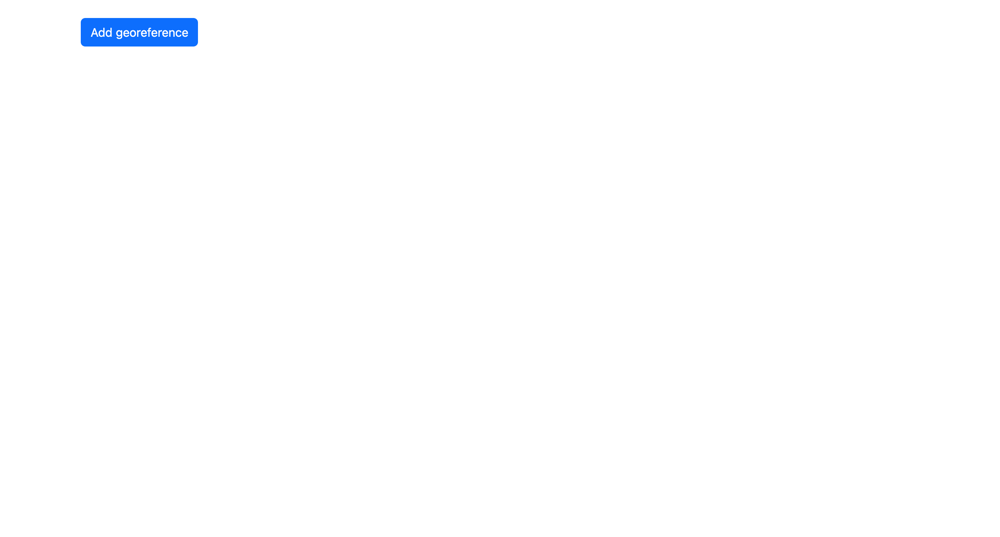
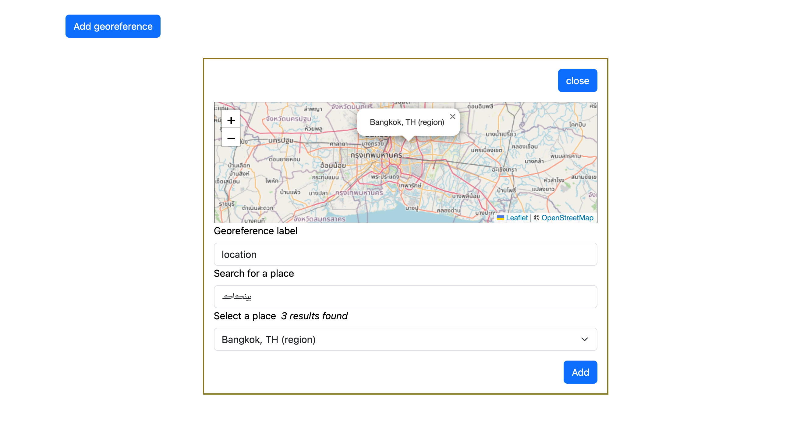
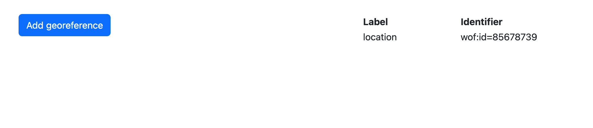
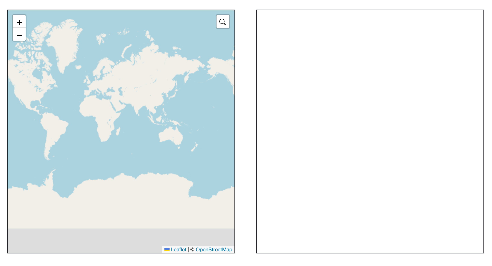
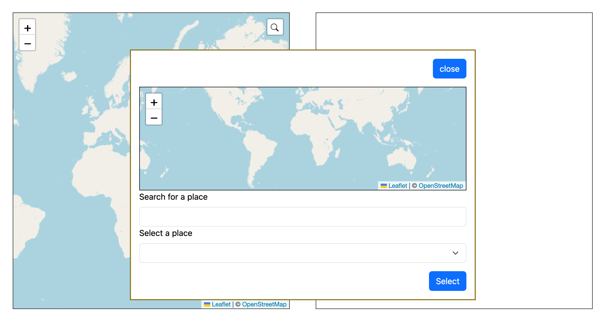
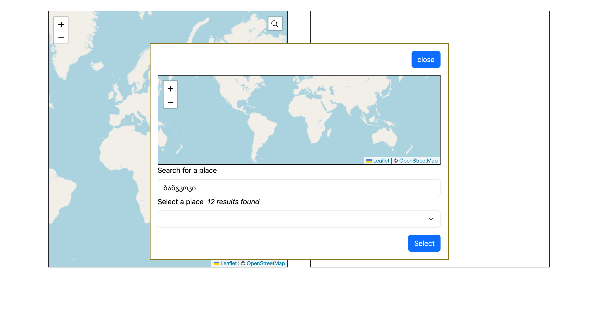
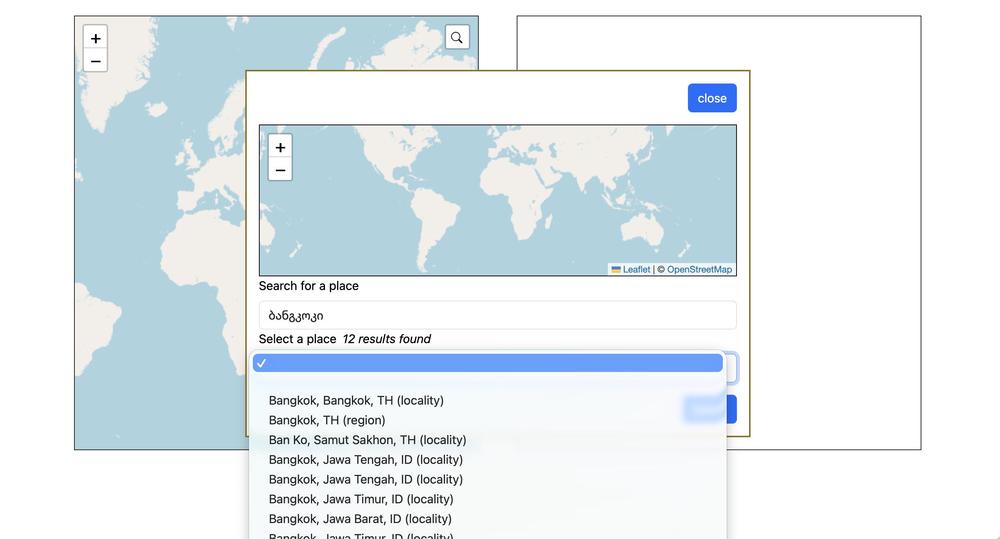
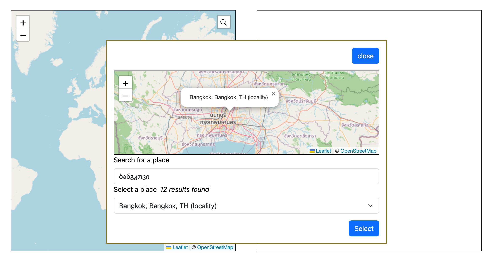
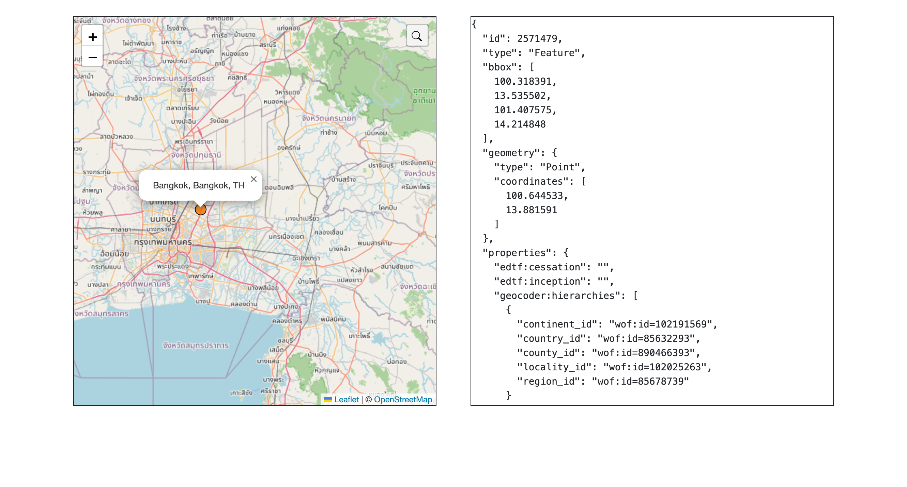

# JavaScript packages

The sfomuseum.geocoder package bundles several small, reusable components that let you add modal geocoding dialogs to a web application, targeting geotagging (deriving coordinates for a place name) and georeferencing (deriving labeled place identifiers for a place name) uses. These dialogs query the API endpoint exposed by this package's [wof-coarse-geocoder-server](../README.md#wof-coarse-geocoder-server) tool.

## tl;dr

* `sfomuseum.geocoder.query` – send a request to the sfomuseum geocoder API.
* `sfomuseum.geocoder.georeference` – open a modal dialog that lets a user type a place name, pick a result and attach a label.
* `sfomuseum.geocoder.geotag` – open a modal dialog that only lets you pick a place (no label).
* `L.control.geocoder` – a Leaflet control that opens the geotag dialog when clicked.

Bundled an minified version of these packages, and their corresponding CSS files, are available in the [dist](../dist) folder.
## Using the `sfomuseum.geocoder` package

```
<script type="text/javascript" src="/path/to/sfomuseum.geocoder.bundle.min.js"></script>
<script type="text/javascript">

const params = new FormData();
params.set("query", "boston");

sfomuseum.geocoder.query(query_params).then((rsp) => {
	// do something with rsp (a GeoJSON FeatureCollection) here
}).catch((err) => {
	console.error("Failed to query geocoder", err);
});

</script>
```

For a complete list of query parameters, consult the detailed [API documentation](../README.md#apiquery).

The default geocoder API endpoint is `http://localhost:8080`. To configure a custom endpoint use the `setEndpoint` method:

```
<script type="text/javascript" src="/path/to/sfomuseum.geocoder.bundle.min.js"></script>
<script type="text/javascript">

sfomuseum.geocoder.setEndpoint("https://api.sfomuseum.org");

const params = new FormData();
params.set("query", "boston");

sfomuseum.geocoder.query(query_params).then((rsp) => {
	// do something with rsp (a GeoJSON FeatureCollection) here
}).catch((err) => {
	console.error("Failed to query geocoder", err);
});

</script>
```

## Using the `sfomuseum.geocoder.georeference` package

```
<!DOCTYPE html>
<html>
<head>
  <meta charset="utf-8">
  <title>sfomuseum.geocoder demo</title>
  <link rel="stylesheet" href="/path/to/leaflet.css" />
  <link rel="stylesheet" href="/path/to/sfomuseum.geocoder.bundle.min.css" />    
  <style>
    #map { height: 400px; }
  </style>
</head>
<body>

<div id="map"></div>

<script type="text/javascript" src="/path/to/leaflet.js"></script>
<script type="text/javascript" src="/path/to/sfomuseum.geocoder.bundle.min.js"></script>
<script type="text/javascript">

  const map = sfomuseum.geocoder.newMap('map');
  // Add tile layer, set map view here...
  
  const button = document.createElement('button');
  button.textContent = 'Add a georeference';
  
  button.onclick = () => {
      sfomuseum.geocoder.georeference.init((label, place_id) => {
          console.log("label", label, "place ID", place_id);
          // Do something with the result
          return Promise.resolve();
      });
  };
  
  document.body.appendChild(button);
</script>
</body>
</html>
```

For a detailed example consult [http/www/demo/georeference.html](../http/www/demo/georeference.html). To see a live version [start the `wof-coarse-geocoder-server` with "demo" mode enabled](../README.md#wof-coarse-geocoder-server) and visit `http://localhost:8080/georeference.html` in your web browser. Here are some screenshots of that application:



The application launches with a single button for adding a new georeference.



Clicking the button will open a modal dialog where you can enter a label and a query term for a place name. Entering a name will trigger a call to the `sfomuseum.geocoder.query` method. Results will be written to the select menu below the query input.


When a place is selected the map (in the modal control) will zoom to that place and show its label.



When you click the "Select" button the modal dialog will close and the label and identifier for the place selected will be written to a table.

Multiple georeferenced locations may be added.

## Using the `sfomuseum.geocoder.geotag` package

```
<!DOCTYPE html>
<html>
<head>
  <meta charset="utf-8">
  <title>sfomuseum.geocoder demo</title>
  <link rel="stylesheet" href="/path/to/leaflet.css" />
  <link rel="stylesheet" href="/path/to/sfomuseum.geocoder.bundle.min.css" />  
  <style>
    #map { height: 400px; }
  </style>
</head>
<body>

<div id="map"></div>

<script type="text/javascript" src="https://unpkg.com/leaflet/dist/leaflet.js"></script>
<script type="text/javascript" src="path/to/sfomuseum.geocoder.bundle.min.js"></script>
<script type="text/javascript">

  const map = L.Map("map");
  // Add tile layer, set map view here...
  
  const button = document.createElement('button');
  button.textContent = 'Add a georeference';
  
  button.onclick = () => {
      sfomuseum.geocoder.georeference.init((label, placeId) => {
          console.log('Label:', label, 'Place ID:', placeId);
          // Do something with the result
          return Promise.resolve();
      });
  };
  
  document.body.appendChild(button);
</script>
</body>
</html>
```

## Using the `L.control.geocoder` control

```
<!DOCTYPE html>
<html>
<head>
  <meta charset="utf-8">
  <title>sfomuseum.geocoder demo</title>
  <link rel="stylesheet" href="/path/to/leaflet.css" />
  <link rel="stylesheet" href="/path/to/sfomuseum.geocoder.bundle.min.css" />  
  <style>
    #map { height: 400px; }
  </style>
</head>
<body>

<div id="map"></div>

<script type="text/javascript" src="https://unpkg.com/leaflet/dist/leaflet.js"></script>
<script type="text/javascript" src="path/to/sfomuseum.geocoder.bundle.min.js"></script>
<script type="text/javascript">

  const map = L.Map("map");
  // Add tile layer, set map view here...

  const geocoderCtrl = L.control.geocoder({
      position: 'topright',
      on_select: (place) => {
          console.log('You selected:', place);
          // place is a GeoJSON Feature (from the API)
      }
  }).addTo(map);
  
</script>
</body>
</html>
```

For a detailed example consult [http/www/demo/geotag.html](../http/www/demo/geotag.html). html). To see a live version [start the `wof-coarse-geocoder-server` with "demo" mode enabled](../README.md#wof-coarse-geocoder-server) and visit `http://localhost:8080/geotag.html` in your web browser. Here are some screenshots of that application:



The application launches showing a basic map with the geocoder "control" in the top right-hand corner.



Clicking the control will open a modal dialog where you can enter a query term for a place name.



Entering a name will trigger a call to the `sfomuseum.geocoder.query` method.



Results will be written to the select menu below the query input.



When a place is selected the map (in the modal control) will zoom to that place and show its label.



When you click the "Select" button the modal dialog will close and the original map will zoom to the selected place.